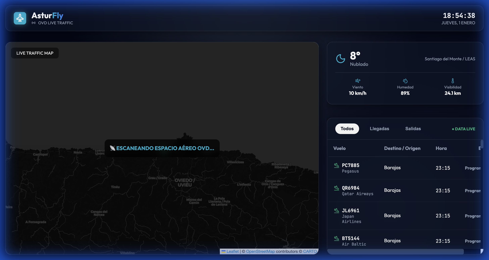

# 🛫 AsturFly - OVD Realtime Monitor


**AsturFly** is a high-performance, real-time flight tracking dashboard specifically designed for the **Asturias Airport (OVD / LEAS)**. It combines live radar data, official flight schedules, and meteorological information to provide a comprehensive monitoring experience.

---

## 📸 Screenshots

| Splash Screen | Live Dashboard | Interactive Map |
| :---: | :---: | :---: |
|  |  |  |

---

## ✨ Features

- 🛰️ **Live Radar:** Real-time aircraft positioning using OpenSky Network API.
- 📋 **Interactive Flight Board:** Automatic matching of radar targets with AviationStack schedule data (Arrivals & Departures).
- 🌦️ **Meteorological Awareness:** Real-time weather data from Santiago del Monte via Open-Meteo, including automatic **IFR/VFR** status detection.
- 🛤️ **Flight Trails:** Visual trajectory tracking for approaching and departing aircraft.
- 📱 **Adaptive UI:** Fully responsive design with an "App-First" philosophy for mobile devices.
- 🌑 **Premium Aesthetics:** Dark-mode glassmorphism interface with vibrant neon accents.

---

## 🚀 Experience it Live

The application is deployed and accessible at:
👉 **[https://josealvarezdev.github.io/Aeropuerto_AST/](https://josealvarezdev.github.io/Aeropuerto_AST/)**

---

## 🛠️ Tech Stack

- **Framework:** [React 19](https://react.dev/)
- **Bundler:** [Vite](https://vitejs.dev/)
- **Mapping:** [Leaflet](https://leafletjs.com/) & [React-Leaflet](https://react-leaflet.js.org/)
- **Animations:** [Framer Motion](https://www.framer.com/motion/)
- **Icons:** [Lucide React](https://lucide.dev/)
- **Styling:** Vanilla CSS (Modern Design System)

---

## 🔧 Installation & Setup

1. **Clone the repository:**
   ```bash
   git clone https://github.com/JoseAlvarezDev/Aeropuerto_AST.git
   cd Aeropuerto_AST
   ```

2. **Install dependencies:**
   ```bash
   npm install
   ```

3. **Configure Environment Variables:**
   Create a `.env` file in the root directory:
   ```env
   VITE_AVIATION_STACK_KEY=your_key_here
   ```

4. **Run in Development Mode:**
   ```bash
   npm run dev
   ```

5. **Build for Production:**
   ```bash
   npm run build
   ```

---

## 📑 License

This project is licensed under the **MIT License**. See the [LICENSE](LICENSE) file for details.

---

## 👨‍💻 Author

Created by **Jose Álvarez Dev**  
[](https://github.com/JoseAlvarezDev)
